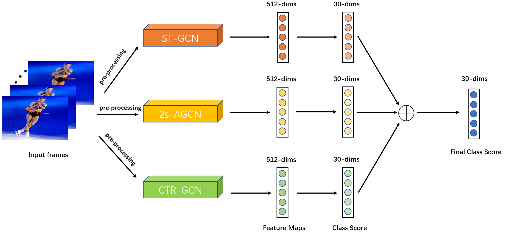

# Fine-Grained Skeleton-Based Human Action Recognition for Figure Skating




## requirements
* paddlevideo>=2.2.0
* numpy
* pandas
* qdm
* PyYAML>=5.1
* opencv-python==4.2.0.32
* decord==0.4.2
* av==8.0.3

Run the following command to install the necessary environment
```
python -m pip install paddlepaddle-gpu==2.2.0.post112 -f https://www.paddlepaddle.org.cn/whl/linux/mkl/avx/stable.html
pip install -r requirements.txt
```


## Model train

### Preprocessing


```
python data_process.py
```
note：Please change the base_path in data_process.py, main function to the root directory of your dataset, the initial dataset directory is as follows.
```
|- base_path
     |- train_data.npy
     |- train_label.npy
     |- test_B_data.npy     
```
The directory after process is shown below
```
|- base_path
    |- fixed1_fold
        |- fold0_train_data.npy
        |- fold0_train_label.npy
        |- fold0_valid_data.npy
        |- fold0_valid_label.npy
        ...
        |- fold5_train_data.npy
        |- fold5_train_label.npy
        |- fold5_valid_data.npy
        |- fold5_valid_label.npy
    |- fixed2_fold
        |- fold0_train_data.npy
        |- fold0_train_label.npy
        |- fold0_valid_data.npy
        |- fold0_valid_label.npy
        ...
        |- fold5_train_data.npy
        |- fold5_train_label.npy
        |- fold5_valid_data.npy
        |- fold5_valid_label.npy
    |- fixed1_train_data.npy
    |- fixed2_train_data.npy
    |- fixed1_test_B_data.npy       
    |- fixed2_test_B_data.npy       
    |- train_data.npy
    |- train_label.npy
    |- test_B_data.npy     
```

### Train
```
python main.py --valid 
```
note: After modifying the dataset root directory, you need to modify the dataset path of the YAML file used in configs/recognition.

The weights are saved in the 'output' folder after training.

### Test
```
python main.py --test
```
Test the trained model weights and generate the corresponding score.npy.


### Ensemble
```
python out_score.py
```
note: The ensemble parameters are predefined in out_score.py.


